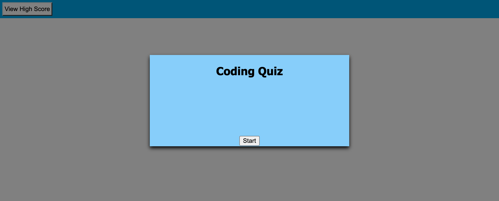
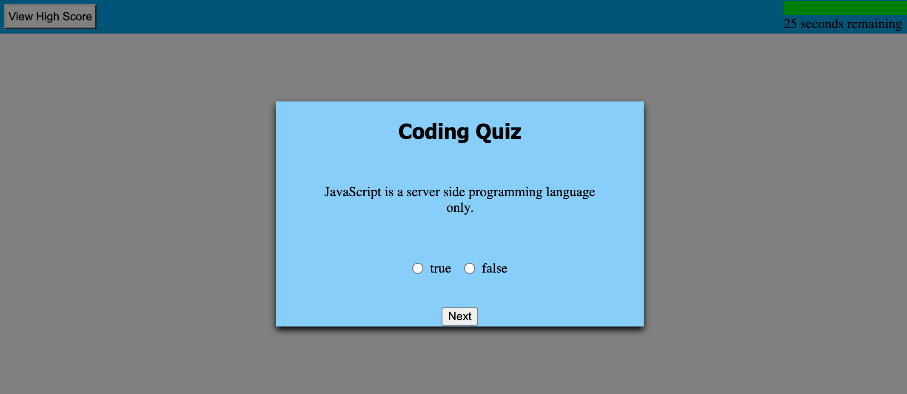
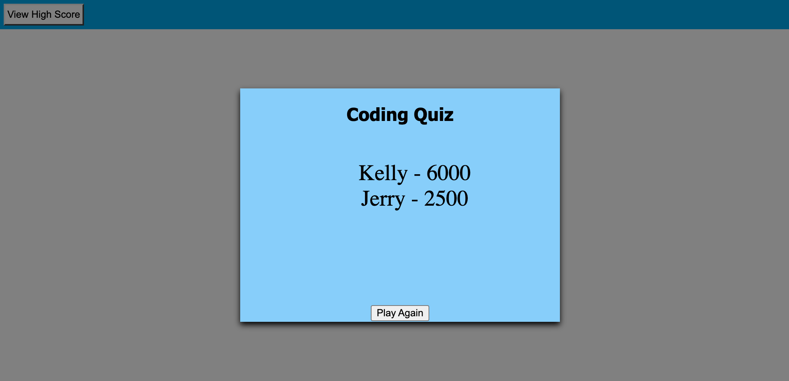

# Code Quiz

-----
## Objectives

In this project, i did the following:

- User will click 'Start Quiz' and be given 5 True / False Questions
- Click the 'Start' button will start a 60 second countdown timer
- Correct buttons are hidden when not needed and appear when needed.
- When incorrect answers are given, time is deducted
- When all questions are answered or time has expired, the quiz ends
- When game is over, user is prompted to enter their initials and name and score are saved on High Score list
- Player High Score list is stored locally
- Player can click button to see the high score list or click try again to restart quiz

-----
## Final screenshots of initial and results page

-----
## Links for Github Repository and final public page

- [Github Repository for Code Quiz](https://github.com/ksjefferies/code-quiz)

- [Code Quiz final page](https://ksjefferies.github.io/code-quiz/)

## Author:

- [Kelly Jefferies](https://github.com/ksjefferies)

## Technologies Used:

## License

